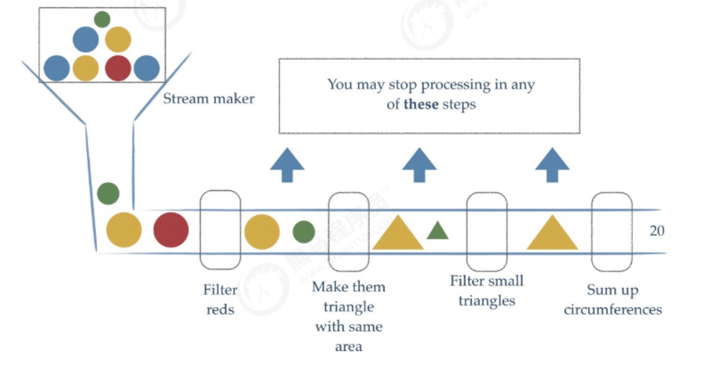
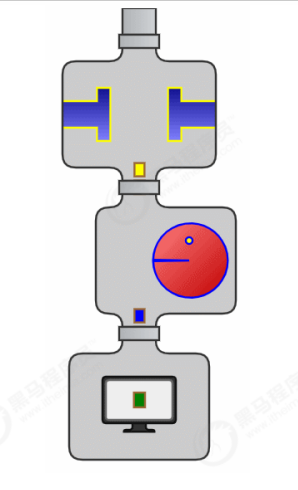
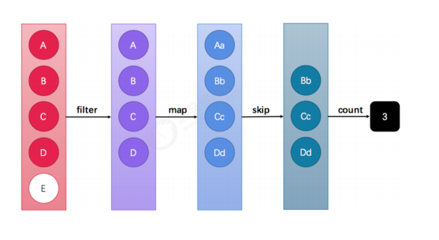

 
### Stream流式思想概述
注意：Stream和IO流(InputStream/OutputStream)没有任何关系，请暂时忘记对传统IO流的固有印象！

Stream流式思想类似于工厂车间的“生产流水线”，Stream流不是一种数据结构，不保存数据，而是对数据进行加工
处理。Stream可以看作是流水线上的一个工序。在流水线上，通过多个工序让一个原材料加工成一个商品。

Stream API能让我们快速完成许多复杂的操作，如筛选、切片、映射、查找、去除重复，统计，匹配和归约
### 获取Stream流的两种方式
- 所有的 Collection 集合都可以通过 stream 默认方法获取流；
- Stream 接口的静态方法 of 可以获取数组对应的流。

方式1 : 根据Collection获取流
首先， java.util.Collection 接口中加入了default方法 stream 用来获取流，所以其所有实现类均可获取流。

方式2 : Stream中的静态方法of获取流
由于数组对象不可能添加默认方法，所以 Stream 接口中提供了静态方法 of ，使用很简单：