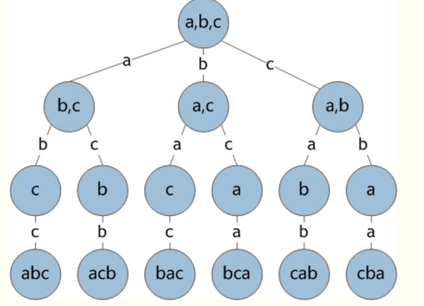

# 全排列

从n个不同元素中任取m（m≤n）个元素，按照一定的顺序排列起来，叫做从n个不同元素中取出m个元素的一个排列。当m=n时所有的排列情况叫全排列。

    

参考文章:

[全排列（递归算法）](https://blog.csdn.net/MsStrbig/article/details/79823555)

## FullPermutationAlgorithm01
[全排列 ：正月点灯笼](https://www.bilibili.com/video/BV1dx411S7WR/?spm_id_from=333.1007.top_right_bar_window_custom_collection.content.click&vd_source=2408eb3d0885a5f3fb0c7c2a6a8d03e2)
## FullPermutationAlgorithm02