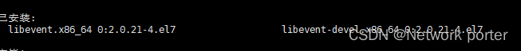
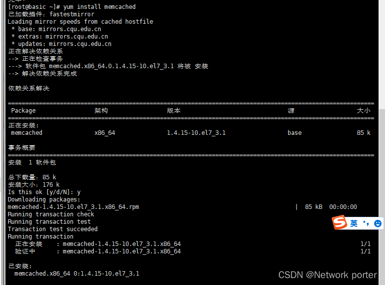
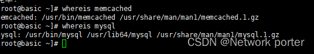
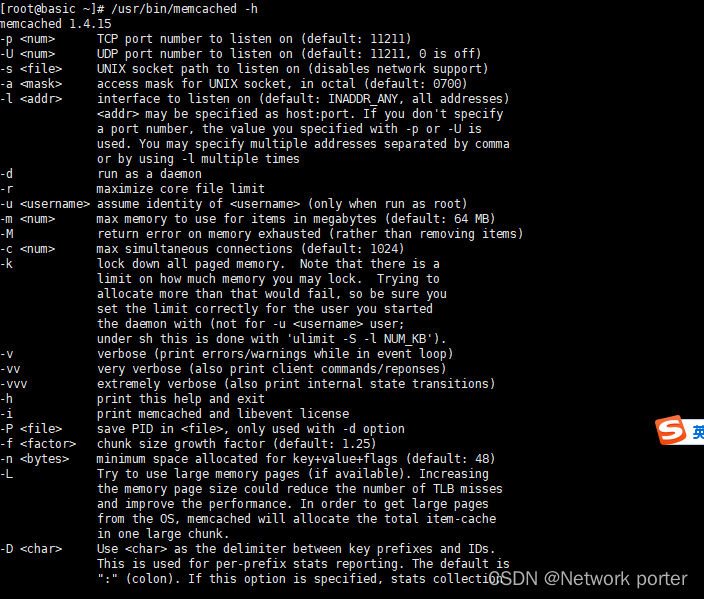

# 二、Linux Memcached 安装
##1.1 常用命令
[常用命令：](https://www.cnblogs.com/jeffwongishandsome/archive/2011/11/06/2238265.html
)

## 2.1、yum centos7安装
### 1.Linux Memcached 安装

```sql
yum install libevent libevent-devel
```
 
### 2.安装 Memcached
 
```powershell
yum install memcached
```


### 3.安装完后可以使用 whereis 查看命令的路径

```powershell
whereis memcached
```

### 4.查看帮助命令
```powershell
/usr/bin/memcached -h
```

### 5.启动命令
1. 前台启动`/usr/bin/memcached -p 11211 -m 64m -vv -u root
   `  ，监听TCP端口11211，最大内存使用量为64M。调试信息的内容大部分是关于存储的信息。启动用户为root
2. 后台启动` /usr/bin/memcached -p 11211 -m 64m -d -u root
   `

 
结束
